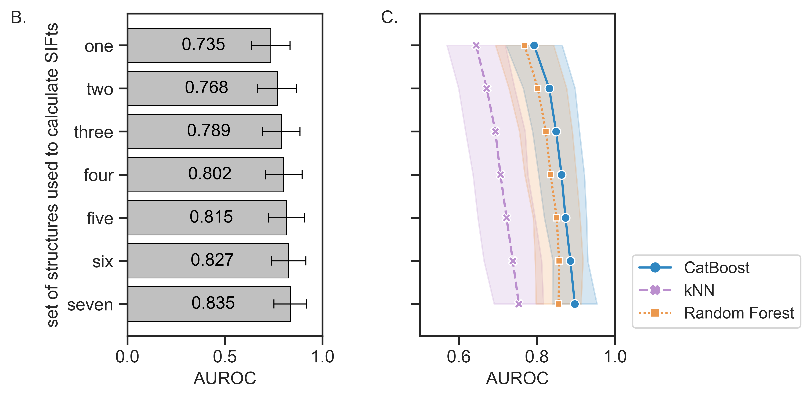

Structural Interaction Fingerprints and Machine Learning for predicting and explaining binding of small molecule ligands to RNA <!-- omit in toc -->
=============

Data accompanying the manuscript on SIFts- and ML-based methods in Virtual Screening for RNA binding ligands - <b>Structural Interaction Fingerprints and Machine Learning for predicting and explaining binding of small molecule ligands to RNA</b>, available [here](https://www.biorxiv.org/content/10.1101/2023.01.11.523582v1?rss=1).

 <!-- markdown-link-check-disable-line -->
[](https://github.com/filipsPL/fingernat-ml/actions/workflows/cffconvert.yml) [](https://doi.org/10.5281/zenodo.7486184) <!-- markdown-link-check-disable-line -->

- [Repository content](#repository-content)
  - [Quick start 🚀](#quick-start-)
  - [0-activity\_datasets](#0-activity_datasets)
  - [1-rna\_targets](#1-rna_targets)
  - [1-rna\_targets-dockprep](#1-rna_targets-dockprep)
  - [2-docking\_poses](#2-docking_poses)
  - [3-rescoring](#3-rescoring)
  - [4-SIFts+activity](#4-siftsactivity)
  - [4-SIFts+activity-arff](#4-siftsactivity-arff)
  - [4-SIFts+activity-csv](#4-siftsactivity-csv)
  - [5-results](#5-results)
  - [6-HIV-structures](#6-hiv-structures)
- [Feedback, issues, and questions](#feedback-issues-and-questions)
- [How to cite](#how-to-cite)
- [Funding](#funding)

# Repository content

All data reside in the `data` directory.

## Quick start 🚀

CSV files with fingerprints and the binding/activity class (0 = non-binder, 1=binder) are stored in [data/4-SIFts%2Bactivity-csv](data/4-SIFts%2Bactivity-csv/).


## 0-activity_datasets

Datasets with active and inactive ligands for five RNA targets. Each sub dir contains a csv file with the structural and activity data, eg.:

| molecule structure                  | name                     | activity | type  |
| :---------------------------------- | :----------------------- | :------- | :---- |
| `c1[nH]c2c(n1)c(ncn2)N              ` | adenine                  | 1        | real  |
| `c1[nH]c2c(n1)c(nc(n2)N)N           ` | 2,6-diaminopurine        | 1        | real  |
| `c1c([nH+]c(nc1N)N)N                ` | 2,4,6-triaminopyrimidine | 1        | real  |
| `c1c2c([nH]cn2)nc(n1)N              ` | 2-aminopurine            | 1        | real  |
| `c1[nH]c2c(=O)[nH]c(nc2n1)N         ` | guanine                  | 1        | real  |
| `c1c2c([nH]cn2)ncn1                 ` | purine                   | 1        | real  |
| `CCc1nc(c(o1)NN)C#N                 ` | P12618448                | 0        | decoy |
| `C[C@@H]1[C@H]([C@H]([C@@H](O1)O)O)O` | P20855218                | 0        | decoy |
| `C[C@@H](C1CC1)N(C(=O)N)O           ` | P21190230                | 0        | decoy |
| `Cc1c(c(c(o1)C)C(=O)[O-])C[NH3+]    ` | P23843064                | 0        | decoy |


Columns contain:
- molecule structure: SMILES encoded structure
- name
- activity:
  - `1` - active
  - `0` - not active
- type:
  - `real` - taken from the literature and the activity was tested experimentally
  - `decoy` - putative inactive molecule were generated with [DUD-E web server](http://dude.docking.org/)


## 1-rna_targets

RNA pdb files used for modelling, as fetched from the pdb database. Eg:

```
├── adenine
│   ├── 1Y26
│   │   └── 1Y26.pdb
│   ├── 4TZX
│   │   └── 4TZX.pdb
│   └── 4XNR
│       └── 4XNR.pdb
```

## 1-rna_targets-dockprep

RNA files (pdb and mol2), cleaned and prepared for docking with dockprep. Eg:

```
├── adenine
│   ├── 1Y26
│   │   ├── rna.mol2
│   │   └── rna.pdb
│   ├── 4TZX
│   │   ├── rna.mol2
│   │   └── rna.pdb
│   └── 4XNR
│       ├── rna.mol2
│       └── rna.pdb
```

## 2-docking_poses

Three best poses from molecular docking, for each RNA structure, saved as sdf files. Eg:

```
├── adenine
│   ├── 1Y26
│   │   └── best_3.sdf
│   ├── 4TZX
│   │   └── best_3.sdf
│   └── 4XNR
│       └── best_3.sdf
```

## 3-rescoring

Scores of docked poses rescored with various functions, calculated for each of the RNA targets. Combined scores are saved in `_all_scores.csv`. Eg:

```
├── adenine
│   ├── 1Y26
│   │   ├── _all_scores.csv
│   │   ├── annapurna.merged.csv
│   │   ├── ligandrna-scores-basic.csv
│   │   ├── ligandrna-scores-modern.csv
│   │   ├── rdock-docksolv.score
│   │   └── rfscore-vs.score
```

## 4-SIFts+activity

Structural Interaction Fingerprints (SIFts) merged with the activity data. For each target, SIFts are calculated in three resolutions:
- full (high-resolution, the one used in the manuscript)
- pbs (medium-resolution, contacts only)
- simple (low-resolution, contacts only)

For each resolution SIFts are calculated for:
- the single best pose (`1-pose` sub directory)
- three top-scored best poses (`3-pose` sub directory; used in the manuscript)

In each subdirectory there are:
- SIFts calculated for the individual structures (eg. `1Y26.csv.gz`)
- horizontally joined SIFts (`joined` subdirectory; as used for building ML models)

Each joined SIFts is available in six variants:
- zero-only containing columns:
  - kept (`withZeros`)
  - removed (when in the column there are only `0` the column was removed; `noZeros`)
- interactions (see also the table above):
  - `allInteractions` - all non-covalent interactions detected
  - `basicInteractions` - basic set of interactions present
  - `basicInteractionsNoLipo` - as above, but without lipophilic interactions


| Subset of interactions                     | Interactions detected                                                                                                                                                                                                                                                                                                                                                                           |
| :----------------------------------------- | :---------------------------------------------------------------------------------------------------------------------------------------------------------------------------------------------------------------------------------------------------------------------------------------------------------------------------------------------------------------------------------------------- |
| Basic: `basicInteractions`                | (i) hydrogen bonds, (ii) halogen bonds, (iii) cation-anion interactions, (iv) Pi-cation interactions, (v) Pi-anion interactions, (vi) Pi-stacking interactions, (vii) metal cation-mediated: magnesium, potassium, sodium, and other metal cation-mediated, (viii) water-mediated interactions, and (ix) lipophilic interactions.                                                               |
| Basic + Extended: `allInteractions`       | All interactions in the Basic subset, and: (x) any interaction (any contact between nucleic acid and ligand), (xi) polar interactions, i.e., hydrogen bonds without angle restraints, (xii) weak polar interactions, i.e., weak hydrogen bonds without angle restraints, (xiii) weak hydrogen bonds without angle restraints (xiv) n→π* interactions, and (xv) halogen multipolar interactions. |
| Basic - {lipo}: `basicInteractionsNoLipo` | Interactions in the Basic subset without lipophilic interactions                                                                                                                                                                                                                                                                                                                                |


```
├── adenine
│   ├── full
│   │   ├── 1-pose
│   │   │   ├── 1Y26.csv.gz
│   │   │   ├── 4TZX.csv.gz
│   │   │   ├── 4XNR.csv.gz
│   │   │   └── joined
│   │   │       ├── withZeros_allInteractions.csv.gz
│   │   │       ├── withZeros_basicInteractions.csv.gz
│   │   │       ├── withZeros_basicInteractionsNoLipo.csv.gz
│   │   │       ├── noZeros_allInteractions.csv.gz
│   │   │       ├── noZeros_basicInteractions.csv.gz
│   │   │       └── noZeros_basicInteractionsNoLipo.csv.gz
│   │   └── 3-pose
│   │       ├── 1Y26.csv.gz
│   │       ├── 4TZX.csv.gz
│   │       ├── 4XNR.csv.gz
│   │       └── joined
│   │           ├── noZeros_allInteractions.csv.gz
│   │           ├── noZeros_basicInteractions.csv.gz
│   │           ├── noZeros_basicInteractionsNoLipo.csv.gz
│   │           ├── withZeros_allInteractions.csv.gz
│   │           ├── withZeros_basicInteractions.csv.gz
│   │           └── withZeros_basicInteractionsNoLipo.csv.gz
```

## 4-SIFts+activity-arff

Data formatted for [Weka](https://www.cs.waikato.ac.nz/~ml/weka/) (average for 3 best poses, 3 structures, with zeros, all interactions).

## 4-SIFts+activity-csv

Auxiliary csv files (average for 3 best poses, 3 structures, with zeros, all interactions).

## 5-results

Raw and compiled ML results. All results are combined in `_collected_ml_results.csv`.

## 6-HIV-structures

Data for SIFts composed from seven RNA structures, to investigate the influence of number of structures on the ML accuracy. Raw data, results, and figures.




# Feedback, issues, and questions

We welcome any feedback, please send an email to Filip Stefaniak  or Natalia Szulc 

# How to cite

If you used the datasets from this repository, please cite:

<b>Structural Interaction Fingerprints and Machine Learning for predicting and explaining binding of small molecule ligands to RNA</b>
Natalia A. Szulc, Zuzanna Mackiewicz, Janusz M. Bujnicki, Filip Stefaniak

<i>bioRxiv</i>

doi: [10.1101/2023.01.11.523582](https://doi.org/10.1101/2023.01.11.523582)

# Funding

This research was funded in part by the National Science Centre in Poland (grant number 2020/39/B/NZ2/03127 to Filip Stefaniak).
